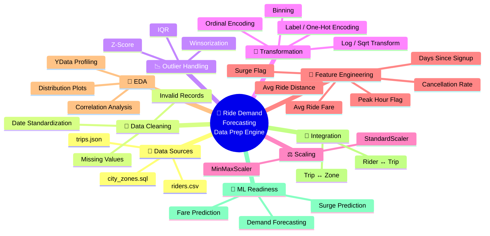
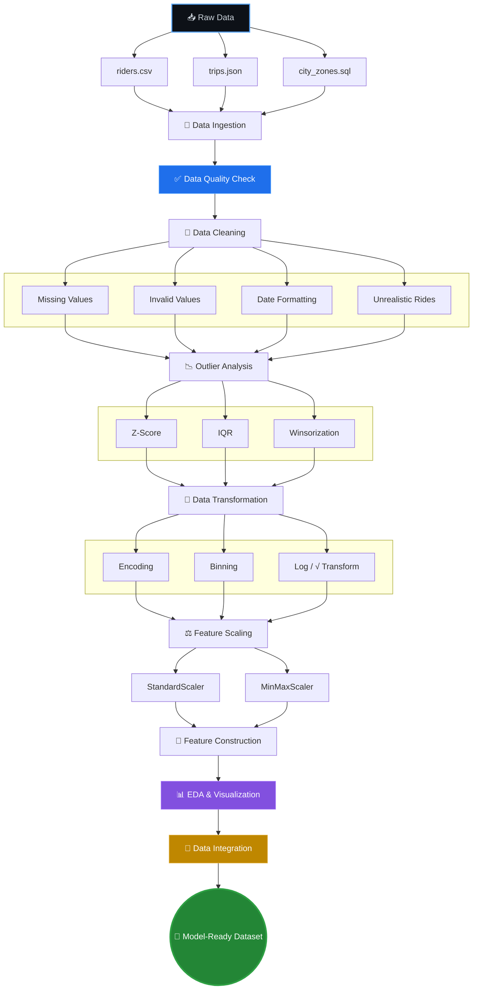
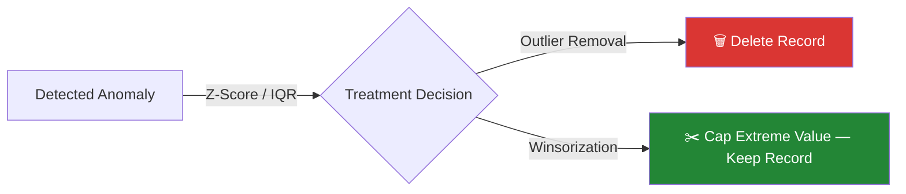
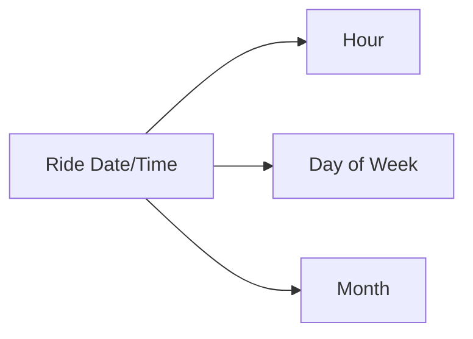
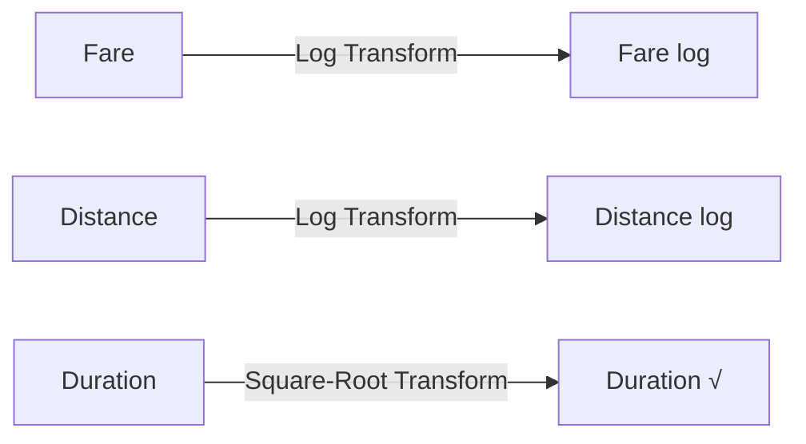
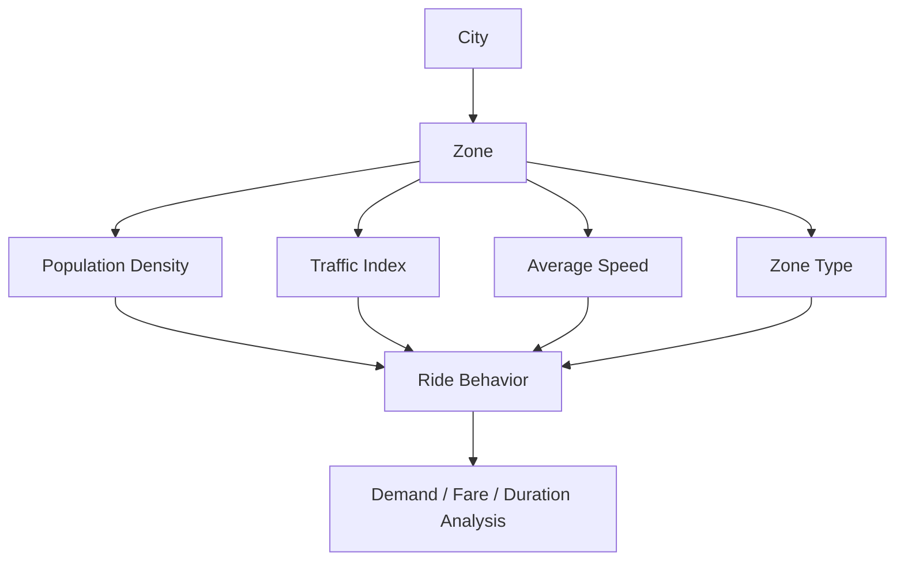
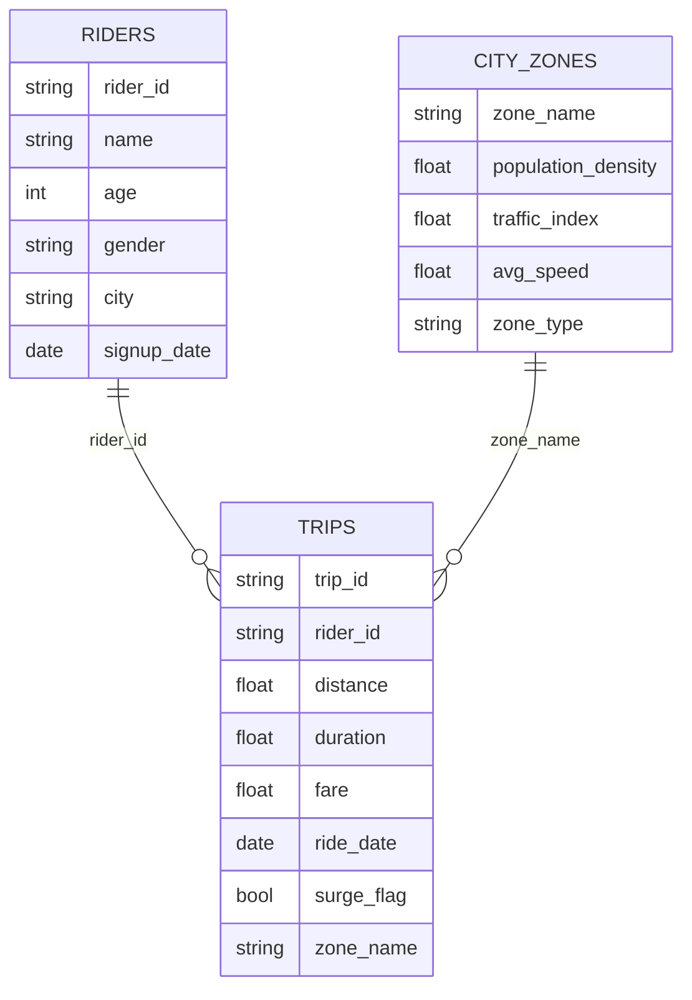
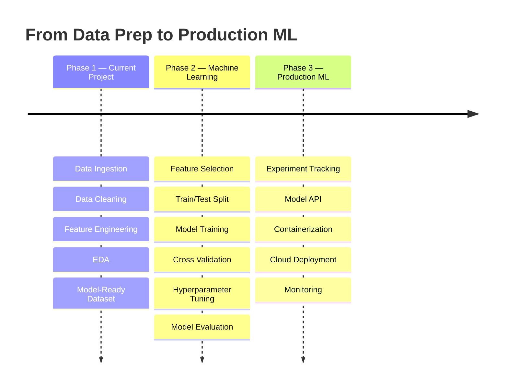

<!--
  📌 SETUP NOTE — delete this comment before publishing:
  This README uses placeholder values you should replace:
    • OWNER/REPO           → your actual "username/repository-name"
    • github.com/RoshanMarathe, linkedin.com/in/roshanmarathe → your real profile links
  Everything else is ready to use as-is.
-->

<div align="center">


<br/>


<p><b>An End-to-End Data Preprocessing & Feature Engineering Pipeline for Ride-Hailing Analytics and Machine Learning</b></p>


<br/>


</div>

<br/>

<div align="center">

<br/><sub>🎞️ Live preview of the preprocessing pipeline in motion</sub>
</div>

<br/>

<details open>
<summary><b>📖 Table of Contents</b></summary>

- [📌 Overview](#-overview)
- [🎯 Project Objective](#-project-objective)
- [🧠 Business Problem](#-business-problem)
- [🧩 Process Mind Map](#-process-mind-map)
- [🏗️ End-to-End Data Pipeline](#️-end-to-end-data-pipeline)
- [📂 Data Sources](#-data-sources)
- [🧹 Data Cleaning](#-data-cleaning)
- [📉 Outlier Detection & Treatment](#-outlier-detection--treatment)
- [🔄 Data Transformation](#-data-transformation)
- [⚖️ Feature Scaling](#️-feature-scaling)
- [🧠 Feature Engineering](#-feature-engineering)
- [🔬 Automated EDA](#-automated-eda)
- [📊 Visualization Gallery](#-visualization-gallery)
- [🗺️ Zone & Geographic Visualization](#️-zone--geographic-visualization)
- [🔗 Data Integration](#-data-integration)
- [📋 Final Dataset](#-final-dataset)
- [🚀 Quick Start](#-quick-start)
- [📁 Repository Structure](#-repository-structure)
- [🧰 Tools & Technologies](#-tools--technologies)
- [🤖 Machine Learning Readiness](#-machine-learning-readiness)
- [🔮 Future Scope & Roadmap](#-future-scope--roadmap)
- [💼 Business Value](#-business-value)
- [🛡️ Data Engineering Principles](#️-data-engineering-principles)
- [🚦 Project Status](#-project-status)
- [📈 Repo Analytics](#-repo-analytics)
- [👨‍💻 Author](#-author)

</details>

---

## 📌 Overview

**Ride Demand Forecasting Data Prep Engine** is an end-to-end data preprocessing and feature engineering project designed around a real-world ride-hailing use case.

The project simulates the data engineering workflow of a ride-sharing company similar to Ola/Uber, where information is distributed across multiple data sources and formats. The primary goal is to transform raw, inconsistent, and heterogeneous ride-hailing data into a **clean, validated, transformed, feature-rich, and machine-learning-ready dataset**.

> **Raw Multi-Source Data → Data Quality → Cleaning → Outlier Analysis → Transformation → Scaling → Feature Engineering → EDA → Data Integration → Model-Ready Dataset**

The resulting dataset can serve as the preprocessing foundation for future machine learning systems such as:

| 🎯 Downstream Application | Description |
|---|---|
| 🚕 Ride Demand Forecasting | Predict ride volume by hour/zone |
| 💰 Surge Pricing Prediction | Predict surge likelihood |
| 📈 Fare Prediction | Estimate trip fare |
| 🚦 Traffic-Aware Ride Analysis | Correlate traffic with trip duration |
| 🕐 Peak-Hour Demand Analysis | Identify high-demand windows |
| 👤 Rider Behavior Analysis | Segment riders by activity |
| 🗺️ Zone-Level Demand Analytics | Compare demand across zones |

---

## 🎯 Project Objective

Build a complete data preprocessing and feature engineering pipeline for real-world ride-hailing data — clean, consistent, and model-ready.

**Key objectives**
- Ingest and reconcile **three different data formats**: CSV (riders), JSON (trips), SQL (city zones)
- Perform data cleaning, missing-value analysis, and outlier detection
- Apply data transformation, feature encoding, and feature scaling
- Engineer business-oriented features
- Run exploratory data analysis
- Produce a final, integrated, model-ready ride-hailing dataset

---

## 🧠 Business Problem

Ride-hailing platforms generate large volumes of data from registrations, bookings, trip completion, fares, payments, traffic conditions, geographic zones, and customer behavior — and raw operational data is rarely ready for machine learning out of the box.

It may contain missing values, inconsistent date formats, invalid fares, unrealistic rides, extreme values, skewed distributions, categorical variables, mismatched numerical scales, and information scattered across multiple sources.

Before building a demand forecasting or surge pricing model, the raw data must pass through a **structured preprocessing pipeline** — which is exactly what this project delivers.

---

## 🧩 Process Mind Map

<div align="center">



</div>

<sub>💡 If your GitHub theme doesn't render the mind map above, the equivalent flowchart in the next section always renders — both describe the same pipeline.</sub>

---

## 🏗️ End-to-End Data Pipeline

<div align="center">



</div>

---

## 📂 Data Sources

The project intentionally works with **three different data formats** to simulate a realistic data engineering environment.

| Dataset | Format | Role | Description |
|---|---|---|---|
| `riders.csv` | CSV | Rider-level data | Demographic and account information |
| `trips.json` | JSON | Trip-level data | Booking and ride transaction information |
| `city_zones.sql` | SQL | Zone-level data | Traffic, population, and zone characteristics |

<br/>

<table>
<tr>
<td valign="top" width="33%">

### 👤 Riders
**Source:** `riders.csv`
**Granularity:** One row per rider

**Attributes**
- Rider ID, Name, Age, Gender, City
- Signup Date
- Total Rides, Cancelled Rides
- Average Rating

**Engineered Features**
- Gender encoded
- Ride frequency
- Total / average distance
- Total / average fare
- Days since signup
- Cancellation rate

</td>
<td valign="top" width="33%">

### 🚕 Trips
**Source:** `trips.json`
**Granularity:** One row per trip

**Attributes**
- Trip ID, Rider ID
- Distance, Duration, Fare
- Ride Date, Surge Flag
- Payment Mode, Zone Info

**Engineered Features**
- Hour / Day of Week / Month
- Fare & Distance Z-scores
- Fare log, Distance log
- Duration square-root
- Standardized & scaled features
- Peak-hour indicator
- Fare per kilometre

</td>
<td valign="top" width="33%">

### 🏙️ City Zones
**Source:** `city_zones.sql`
**Granularity:** One row per zone

**Attributes**
- Zone Name
- Population Density
- Traffic Index
- Average Speed
- Zone Type

Provides contextual signal for demand, fare, and traffic analysis.

</td>
</tr>
</table>

---

## 🧹 Data Cleaning

The cleaning stage validates the datasets before downstream processing.

### Missing Value Analysis

| Data Type | Strategy |
|---|---|
| Numerical | Mean-based imputation via `SimpleImputer`, applied only where missing values exist |
| Categorical | Most-Frequent strategy, applied only where missing values exist |
| Multivariate numerical (Duration, Distance, Fare) | `KNNImputer` for related numerical variables |

### 📅 Date Standardization
`signup_date` and `ride_date` are converted into a consistent datetime representation — a reliable foundation for temporal feature engineering.

### 🚨 Unrealistic Data Detection

| Check | Rule |
|---|---|
| Negative Fare | Treated as an unrealistic transaction record |
| Zero-Distance but Billed | `Distance = 0 AND Fare > 0` flagged as potentially unrealistic |

---

## 📉 Outlier Detection & Treatment



| Method | Applied To | Behavior |
|---|---|---|
| **Z-Score** | Fare, Distance | Detects unusual observations — not automatically removed |
| **IQR** | Trip Duration | Flags observations outside the expected quartile range — analyzed, not deleted |
| **Winsorization** | Extreme fare values | Caps extreme observations rather than deleting complete records |

---

## 🔄 Data Transformation

### 🕐 Datetime Features

> If the source date contains no time component, meaningful hourly demand cannot be inferred without additional time information.

### 🏷️ Categorical Encoding

| Technique | Applied To |
|---|---|
| Label Encoding | Gender |
| One-Hot Encoding | Payment Mode, Zone Name |
| Ordinal Encoding | Explicit ordered traffic-level category (`Low < Medium < High`) — the numerical `traffic_index` field itself stays numerical |

### 📦 Binning
Customer ride frequency is divided into **Low / Medium / High**, based on total ride activity, for interpretable behavior segmentation.

### 📐 Skewness Transformation



---

## ⚖️ Feature Scaling

| Technique | Result |
|---|---|
| **StandardScaler** | Mean ≈ 0, Standard Deviation ≈ 1 |
| **MinMaxScaler** | Minimum ≈ 0, Maximum ≈ 1 |

Scaling is evaluated before vs. after using Mean, Standard Deviation, Minimum, and Maximum.

---

## 🧠 Feature Engineering

| Feature | Formula |
|---|---|
| 📏 Average Ride Distance | `Total Distance / Total Rides` |
| 💰 Average Ride Fare | `Total Fare / Total Rides` |
| 🕐 Peak Hour Indicator | Morning 07:00–09:00 or Evening 18:00–21:00 → `1`, else `0` |
| 📅 Days Since Signup | `Current Date − Signup Date` |
| ❌ Ride Cancellation Rate | `Cancelled Rides / Total Rides` |
| 🚦 Surge Flag | Threshold on `Fare / Distance` (fare-per-distance) |

---

## 🔬 Automated EDA

An automated EDA report is generated using **YData Profiling**, covering:

`Dataset structure` · `Data types` · `Missing values` · `Duplicate values` · `Descriptive statistics` · `Numerical & categorical distributions` · `Correlations` · `Data-quality warnings` · `Variable relationships`

📄 Full report: [`reports/ride_demand_eda_report.html`](reports/ride_demand_eda_report.html)

---

## 📊 Visualization Gallery

<table>
<tr>
<td width="50%">

**🚕 Ride Demand by Hour**


*Business Question:* When is ride demand highest?
*Applications:* Driver allocation, fleet planning, staffing, peak-hour strategy

</td>
<td width="50%">

**🚦 Surge vs No-Surge Trip Patterns**


*Business Question:* How frequently does surge pricing occur vs normal rides?

</td>
</tr>
</table>

> **Data limitation:** if the provided ride date contains only a calendar date without time, hourly demand cannot be reliably inferred.

### 📈 Distribution Analysis (Before vs After Transformation)

<table>
<tr>
<td width="33%"><b>Fare</b><br/></td>
<td width="33%"><b>Distance</b><br/></td>
<td width="33%"><b>Duration</b><br/></td>
</tr>
</table>

### 📦 Outlier Visualization

<table>
<tr>
<td width="33%"><b>Fare — Z-Score</b><br/></td>
<td width="33%"><b>Distance — Z-Score</b><br/></td>
<td width="33%"><b>Duration — IQR</b><br/></td>
</tr>
</table>

---

## 🗺️ Zone & Geographic Visualization



<div align="center">

</div>

> A true geographic map should only be generated when reliable latitude/longitude coordinates or spatial geometries are available.

---

## 🔗 Data Integration



---

## 📋 Final Dataset

| Component | Includes |
|---|---|
| **Rider Information** | Demographics, activity, tenure, cancellation behavior, ride frequency |
| **Trip Information** | Distance, duration, fare, payment info, temporal features, surge info |
| **Zone Information** | Population density, traffic index, average speed, zone type |
| **Engineered Information** | Avg ride distance/fare, peak-hour flag, days since signup, cancellation rate, surge features, transformed & scaled numerical features |

**Final validation checks:** row/column counts, missing values, data types, duplicate records, engineered features, transformation & scaling results, outlier analysis, dataset consistency.

**📤 Final Output:** [`Final_data_set/final_prepared_rides_dataset.csv`](Final_data_set/final_prepared_rides_dataset.csv)

---

## 🚀 Quick Start

[](https://colab.research.google.com/github/OWNER/REPO/blob/main/File/ride_demand_data_preprocessing.ipynb)

### 1️⃣ Clone the repository
```bash
git clone https://github.com/OWNER/REPO.git
cd REPO
```

### 2️⃣ Install dependencies
```bash
pip install pandas numpy scikit-learn scipy matplotlib ydata-profiling jupyter
```

### 3️⃣ Run the notebook (recommended order)

| Step | Notebook Section |
|---|---|
| 01 | Data Loading |
| 02 | Data Understanding |
| 03 | Data Cleaning |
| 04 | Outlier Detection & Treatment |
| 05 | Data Transformation |
| 06 | Feature Scaling |
| 07 | Feature Construction |
| 08 | EDA & Visualization |
| 09 | Dataset Integration |
| 10 | Final Export |

```bash
jupyter notebook File/ride_demand_data_preprocessing.ipynb
```

This ensures the workflow reproduces consistently, end to end.

---

## 📁 Repository Structure

```
ride-demand-forecasting-data-prep/
│
├── 📂 data/
│   ├── raw/
│   ├── riders.csv
│   ├── trips.json
│   └── city_zones.sql
│
├── 📂 Final_data_set/
│   └── final_prepared_rides_dataset.csv
│
├── 📂 File/
│   └── ride_demand_data_preprocessing.ipynb
│
├── 📂 assets/
│   ├── workflow.png
│   └── preprocessing_workflow.gif
│
├── 📂 reports/
│   └── ride_demand_eda_report.html
│
└── README.md
```

---

## 🧰 Tools & Technologies

<div align="center">

| Category | Tools |
|---|---|
| Programming | Python |
| Data Processing | Pandas, NumPy |
| Statistics | SciPy |
| ML Preprocessing | Scikit-learn |
| Visualization | Matplotlib |
| Automated EDA | YData Profiling |
| Database | SQLite |
| Environment | Jupyter Notebook |
| Geographic Visualization | Folium / GeoPandas (when spatial data is available) |

</div>

---

## 🤖 Machine Learning Readiness

<table>
<tr>
<td valign="top" width="50%">

### 🚕 Ride Demand Forecasting
**Target:** Ride Count / Demand
**Predictors:** Hour, Day of Week, Month, Zone, Population Density, Traffic Index, Average Speed, Peak-Hour Indicator, Historical ride activity

</td>
<td valign="top" width="50%">

### 💰 Surge Pricing Prediction
**Target:** Surge Flag
**Predictors:** Fare, Distance, Traffic, Zone, Peak Hour, Population Density, Ride activity, Historical demand

</td>
</tr>
</table>

---

## 🔮 Future Scope & Roadmap



**Potential future technologies:** XGBoost · LightGBM · Random Forest · Time-Series Forecasting · MLflow · FastAPI · Docker · GitHub Actions · Cloud Deployment · Model Monitoring

---

## 💼 Business Value

| Theme | Question This Dataset Helps Answer |
|---|---|
| Demand | Which periods generate the highest ride activity? |
| Customer Behavior | Which riders have high ride frequency? |
| Cancellation | Which riders show higher cancellation rates? |
| Pricing | Which trips have unusually high fare-per-distance values? |
| Traffic | How does traffic relate to ride duration? |
| Geography | How do ride characteristics differ across city zones? |
| Operations | When should additional drivers be allocated? |

---

## 🛡️ Data Engineering Principles

1. **Validate Before Transforming** — raw data is inspected before preprocessing.
2. **Don't Delete Data Without Justification** — statistical anomalies aren't automatically treated as invalid.
3. **Preserve Original Information** — transformed features are retained separately where appropriate.
4. **Don't Invent Information** — missing time information is never artificially generated.
5. **Use the Correct Preprocessing Technique** — different data types get different strategies.
6. **Keep the Pipeline Reproducible** — the full workflow lives in a structured, ordered notebook.

---

## 🚦 Project Status

**Status:** ✅ Data Preprocessing & Feature Engineering Completed

- [x] Multi-format data ingestion
- [x] Data quality assessment
- [x] Missing-value analysis
- [x] Invalid record detection
- [x] Outlier detection & Winsorization
- [x] Datetime processing
- [x] Categorical encoding & binning
- [x] Numerical transformation & scaling
- [x] Feature construction
- [x] Automated EDA & visualization
- [x] Dataset integration
- [x] Final CSV generation
- [ ] Feature selection
- [ ] Demand forecasting model
- [ ] Surge prediction model
- [ ] Model evaluation & hyperparameter optimization
- [ ] Explainable AI
- [ ] Model deployment & production monitoring

---

## 📈 Repo Analytics

<div align="center">


[](https://star-history.com/#OWNER/REPO&Date)

</div>

---

## 👨‍💻 Author

<div align="center">

### Roshan Marathe
**Data Science · Data Analytics · Machine Learning · Python**

*This project was developed as a practical demonstration of data preprocessing, feature engineering, and analytical thinking using a realistic ride-hailing business scenario.*

<sub>⬇️ update these links with your real profiles before publishing</sub>

[](https://github.com/RoshanMarathe)
[](https://www.linkedin.com/in/roshanmarathe)
[](mailto:your.email@example.com)

</div>

<br/>

<div align="center">

### 🚕 From Raw Ride Data to Machine Learning Intelligence
**CSV + JSON + SQL → Clean → Transform → Engineer → Analyze → Integrate → ML Ready**

⭐ If you found this project useful, consider starring the repository!

</div>


